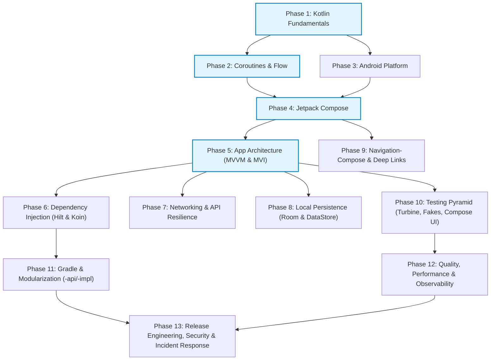

# Modern Android Development Master Curriculum

> A comprehensive, production-grade Android development curriculum and real-time enterprise application repository engineered for developers with a **Java / QA Automation / Backend** background transitioning into **Professional Android Engineering**.

---

## 🏛️ Repository Structure

```
├── enterprise-finance-tracker-real-time-app/  # 🚀 The Step-by-Step Incremental Real-Time App
│   ├── ARCHITECTURE.md                        # Architecture blueprint & stage evolution
│   ├── DECISIONS.md                           # Architecture Decision Records (ADRs)
│   ├── DEBUGGING.md                           # Bug investigation logs & debugging challenges
│   ├── TESTING.md                             # Testing strategy & Given-When-Then specs
│   ├── prompt.md                              # Master incremental build prompt
│   └── src/                                   # Application source code (evolved stage-by-stage)
│
├── milestones/                                # 🗺️ 12 Milestone guides for building from scratch
├── phase-1-kotlin.md                          # 📘 Phase 1: Kotlin (18 concepts)
├── phase-2-coroutines-and-flow.md             # 📘 Phase 2: Coroutines & Flow (19 concepts)
├── phase-3-android-platform-fundamentals.md   # 📘 Phase 3: Platform Fundamentals (14 concepts)
├── phase-4-jetpack-compose.md                 # 📘 Phase 4: Jetpack Compose (16 concepts)
├── phase-5-app-architecture.md                # 📘 Phase 5: App Architecture (11 concepts)
├── phase-6-dependency-injection.md            # 📘 Phase 6: Dependency Injection (9 concepts)
├── phase-7-networking.md                      # 📘 Phase 7: Networking & Resilience (11 concepts)
├── phase-8-local-persistence.md               # 📘 Phase 8: Local Persistence (9 concepts)
├── phase-9-navigation.md                      # 📘 Phase 9: Navigation-Compose (10 concepts)
├── phase-10-testing.md                        # 📘 Phase 10: Testing Pyramid (11 concepts)
├── phase-11-gradle-and-modularization.md      # 📘 Phase 11: Gradle & Modularization (10 concepts)
├── phase-12-quality-performance-and-observability.md # 📘 Phase 12: Quality & Observability (10 concepts)
└── phase-13-release-engineering-and-production-playbook.md # 📘 Phase 13: Release Engineering (8 concepts)
```

---

## 🎯 Curriculum Philosophy & Methodology

Every concept across all 13 phases follows a strict, deep **13-Step Pedagogical Sequence**:

```mermaid
flowchart LR
    A["1. What is it"] --> B["2. Why does it exist"]
    B --> C["3. Mental Model"]
    C --> D["4. Mechanics"]
    D --> E["5. Realistic Code"]
    E --> F["6. Production Usage"]
    F --> G["7. Common Mistakes"]
    G --> H["8. Debugging"]
    H --> I["9. Testing"]
    I --> J["10. Exercise"]
    J --> K["11. Deliberate Failure"]
    K --> L["12. Interview Prep"]
    L --> M["13. Checkpoint Gate"]
```



### The QA / Backend Developer Advantage
This curriculum does not waste time teaching basic OOP or syntax loops. Instead, it bridges your existing knowledge:
- **Selenium / Appium Page Objects & DOM** ➔ **Jetpack Compose Stateless UI Trees & Semantics**
- **TestNG / REST Assured** ➔ **Turbine, Coroutine Virtual Time & MockWebServer**
- **Spring Boot `@Service` / `@Repository` / `@Autowired`** ➔ **Clean Architecture & Android DI (Hilt / Koin)**
- **SQL / JPA / Hibernate** ➔ **Room ORM Reactive Flow Queries & DataStore**
- **Maven `pom.xml`** ➔ **Gradle Kotlin DSL (`build.gradle.kts`), Version Catalogs & Convention Plugins**

---

## 🗺️ Topic Dependency & Learning Graph



---

## 📚 The 13 Phases of Modern Android Development

| Phase | Guide Document | Core Topics & Competencies | Deliverables & Project Version |
|:---:|:---|:---|:---|
| **01** | [Phase 1: Kotlin Fundamentals](phase-1-kotlin.md) | `val`/`var`, Null Safety, Data Classes, Sealed Interfaces, Higher-Order Functions, Scope Functions, Operator Overloading (`invoke`), Delegation, Value Classes | **Expense Tracker v1**: Kotlin-only Domain Model |
| **02** | [Phase 2: Coroutines & Flow](phase-2-coroutines-and-flow.md) | `suspend` CPS State Machines, Structured Concurrency, `CancellationException` Discipline, Dispatchers, Cold `Flow`, Hot `StateFlow`/`SharedFlow`, `WhileSubscribed(5000)` | **Expense Tracker v3**: Coroutine & Flow Reactive Cache |
| **03** | [Phase 3: Android Platform](phase-3-android-platform-fundamentals.md) | Activity Lifecycle, Process Death, `SavedStateHandle`, Single-Activity Architecture, Intents, Permissions, `WorkManager`, ADB Mastery | **Platform Verification App**: Process-death & rotation survival |
| **04** | [Phase 4: Jetpack Compose](phase-4-jetpack-compose.md) | Declarative UI, Recomposition Mechanics, State Hoisting, Modifiers, Lazy Lists & Keys, Material 3 Design Tokens, 3-Layer Screen Pattern (Route → Screen → Component) | **Expense Tracker v2**: Multi-Screen Compose UI |
| **05** | [Phase 5: App Architecture](phase-5-app-architecture.md) | Clean Architecture, Inward Dependency Rule, SSOT, Mappers at Boundaries, MVVM vs MVI built side-by-side on identical features | **Expense Tracker v4**: Clean Layered Architecture slice |
| **06** | [Phase 6: Dependency Injection](phase-6-dependency-injection.md) | Scopes & Lifetimes, Hilt (Dagger compile-time, `@Binds`), Koin (Kotlin DSL runtime, `singleOf`), DI Anti-patterns | **Expense Tracker v5**: Dual Hilt & Koin DI graph |
| **07** | [Phase 7: Networking](phase-7-networking.md) | Retrofit, OkHttp Interceptors, Certificate Pinning, `kotlinx.serialization`, 401 Token Refresh with synchronized `Mutex`, 6-path error resilience | **Expense Tracker v6**: Resilient REST Client |
| **08** | [Phase 8: Local Persistence](phase-8-local-persistence.md) | Jetpack DataStore (Preferences & Proto), Room Database, Reactive SQLite `Flow` queries, SSOT Network-Bound Resource, Schema Migrations | **Expense Tracker v7**: Offline-First Room Storage |
| **09** | [Phase 9: Navigation](phase-9-navigation.md) | Type-Safe Navigation-Compose (`@Serializable` routes), Back Stack Management (`popUpTo`, `launchSingleTop`), Deep Links, Predictive Back | **Expense Tracker v8**: Type-Safe Route Graph |
| **10** | [Phase 10: Testing](phase-10-testing.md) | Modern Test Pyramid, `runTest` Virtual Time, Flow Testing with Turbine, Fakes vs Mocks, Compose UI Semantics, Roborazzi Screenshot Diffing | **Expense Tracker v9**: Full Pyramid Test Suite |
| **11** | [Phase 11: Gradle & Modularization](phase-11-gradle-and-modularization.md) | Gradle Build Lifecycle, Version Catalogs (`libs.versions.toml`), Build Caching & KSP, Convention Plugins, `-api` / `-impl` Module Split | **Expense Tracker v10**: Multi-Module Architecture |
| **12** | [Phase 12: Quality & Observability](phase-12-quality-performance-and-observability.md) | Custom Detekt Rules, Startup Optimization & Baseline Profiles, 16.6ms Frame Budget & Jank, LeakCanary Diagnostics, ANRs, RUM Telemetry | **Performance Suite**: Leak-free, profiled release build |
| **13** | [Phase 13: Release & Playbook](phase-13-release-engineering-and-production-playbook.md) | Google Play Staged Rollouts, AAB & Play App Signing, Android Keystore & Biometrics, OWASP Security, Fastlane CI/CD, 4-Level Incident Playbook | **Production Release**: Fastlane pipeline & incident drill |

---

## 📱 The Real-Time App: `enterprise-finance-tracker-real-time-app`

The active, incremental application lives in **[`enterprise-finance-tracker-real-time-app/`](enterprise-finance-tracker-real-time-app/)**.

- **Stage 1 (Completed)**: Pure Kotlin Domain Foundation (Entities, value classes, validation, tests)
- **Stage 2 (Completed)**: Android Platform Fundamentals (Gradle, Manifest, Application, Activity lifecycle, StrictMode)
- **Stage 3 (Next)**: Jetpack Compose UI (Authentication, Dashboard, Transactions list, Material 3)
- ... evolving through all 13 stages!

---

## 📖 Master Reference Documents

- **[Master Prompt & Instructor Blueprint](master-prompt-android-learning-guide.md)**: Defines the teaching protocol, source-of-truth rules, stuck escalation protocols, and evaluation criteria.
- **[Android Development Learning Path](android-development-learning-path.md)**: The comprehensive curriculum source document.
- **[Master Project Prompt](master-prompt-expense-tracker-project.md)**: Architecture directives and execution protocols for project milestones.
