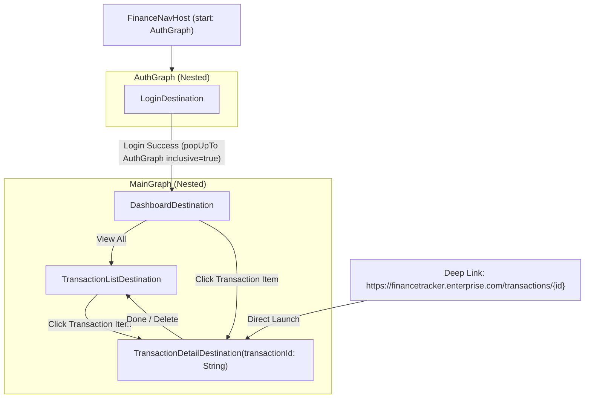

# Architecture Blueprint — Enterprise Finance Tracker

## 1. High-Level Target Architecture

The application implements Google's recommended **Clean Architecture with Unidirectional Data Flow (UDF)** powered by Type-Safe Navigation:

```
┌────────────────────────────────────────────────────────┐
│               Type-Safe Navigation-Compose             │
│        (FinanceNavHost with Animated Transitions)      │
│                                                        │
│   ┌─────────────────────┐       ┌──────────────────┐   │
│   │ AuthGraph           │       │ MainGraph        │   │
│   │ • LoginDestination  │──────►│ • DashboardDest  │   │
│   │ (Cleared on Login)  │PopUpTo│ • TxListDest     │   │
│   └─────────────────────┘       │ • TxDetail(id)   │   │
│                                 └──────────────────┘   │
└──────────────────────────┬─────────────────────────────┘
                           │ (Collects StateFlow)
┌──────────────────────────▼─────────────────────────────┐
│                            ViewModel Layer             │
│   • DashboardViewModel & TransactionListMviViewModel   │
└──────────────────────────┬─────────────────────────────┘
                           │ (Calls UseCases)
┌──────────────────────────▼─────────────────────────────┐
│                      Domain Layer                      │
│   • Use Cases (operator fun invoke())                  │
└──────────────────────────▲─────────────────────────────┘
                           │ (Implemented in Data)
┌──────────────────────────┴─────────────────────────────┐
│                 Data Layer (Offline-First SSOT)         │
│   • Room Database (SQLite SSOT)                        │
│   • Retrofit Remote Sync & OkHttp 401 Mutex            │
└────────────────────────────────────────────────────────┘
```

---

## 2. Navigation Graph Hierarchy & Backstack Flow



---

## 3. Deep Linking Verification Workflow

1. An external app or push notification dispatches an `ACTION_VIEW` intent with URL `https://financetracker.enterprise.com/transactions/tx_100`.
2. The Android OS inspects `AndroidManifest.xml` intent-filter with `android:autoVerify="true"`.
3. `MainActivity` receives the intent. `Navigation-Compose` matches the URL against `navDeepLink<TransactionDetailDestination>`.
4. The router automatically deserializes `destination.transactionId` and navigates directly to `TransactionDetailDestination`, pushing `DashboardDestination` into the synthetic backstack so the Back button returns to the home screen.
