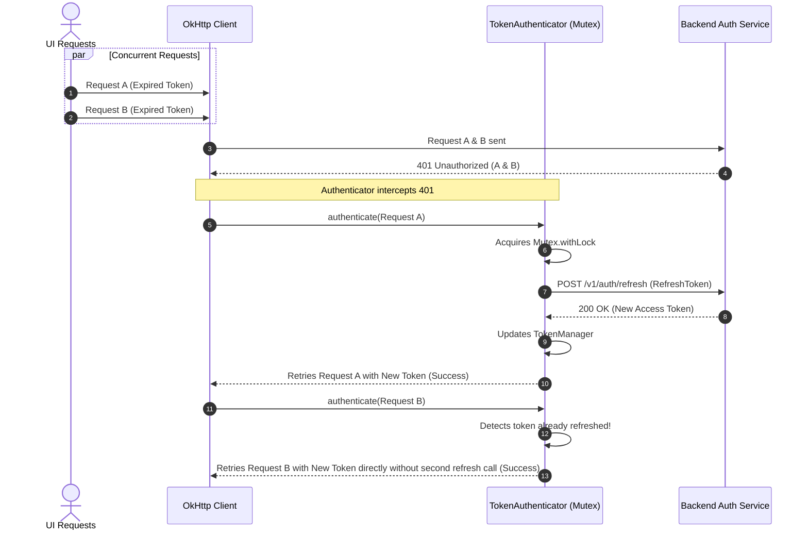

# Architecture Blueprint — Enterprise Finance Tracker

## 1. High-Level Target Architecture

The application implements Google's recommended **Clean Architecture with Unidirectional Data Flow (UDF)** powered by Dependency Injection and Resilient Networking:

```
┌────────────────────────────────────────────────────────┐
│                        UI Layer                        │
│   Jetpack Compose (Stateless Screens + Atomic Atoms)   │
│                          ↓                             │
│   ViewModel (MVI State Machine / MVVM State Holder)    │
│              (StateFlow<UiState> + UI Intents)         │
└──────────────────────────┬─────────────────────────────┘
                           │ (Injected via koinViewModel())
┌──────────────────────────▼─────────────────────────────┐
│                      Domain Layer                      │
│   Use Cases (factoryOf(::UseCase), invoke())           │
│   Domain Entities & Value Classes (Pure Kotlin)        │
│   Repository Interfaces (Contracts)                    │
└──────────────────────────▲─────────────────────────────┘
                           │ (singleOf(::RepositoryImpl) bind Repository::class)
┌──────────────────────────┴─────────────────────────────┐
│                       Data Layer                       │
│   Repository Implementations (SSOT)                    │
│   Local DataSource          │      Remote DataSource   │
│   (InMemory / Room DB)      │    (Retrofit + OkHttp)   │
└────────────────────────────────────────────────────────┘
```

---

## 2. 401 Token Refresh & Mutex Lock Architecture

When multiple concurrent HTTP requests receive a `401 Unauthorized` simultaneously, the OkHttp `TokenAuthenticator` coordinates with a Coroutine `Mutex` to guarantee that **only one refresh HTTP request** is dispatched to the backend:



---

## 3. The 6 Canonical Network Failure Paths

Every network operation passes through `safeApiCall` which intercepts low-level transport exceptions and translates them into domain failure states:

1. **`401 Unauthorized`** ➔ `FinancialResult.Failure.Unauthorized` (triggers re-auth or login flow).
2. **`404 Not Found`** ➔ `FinancialResult.Failure.ValidationError` (resource not found on server).
3. **`500+ Server Error`** ➔ `FinancialResult.Failure.UnexpectedError` (remote service degraded).
4. **`SocketTimeoutException`** ➔ `FinancialResult.Failure.NetworkError` (slow link, unfulfilled SLA).
5. **`UnknownHostException`** ➔ `FinancialResult.Failure.NetworkError` (device offline / DNS failure).
6. **`SerializationException`** ➔ `FinancialResult.Failure.UnexpectedError` (client/server contract mismatch).
