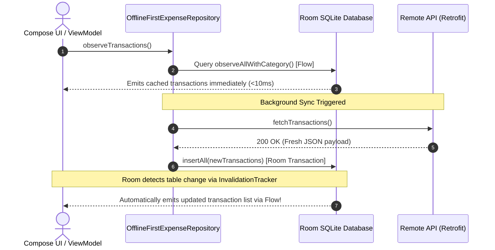

# Architecture Blueprint — Enterprise Finance Tracker

## 1. High-Level Target Architecture

The application implements Google's recommended **Clean Architecture with Unidirectional Data Flow (UDF)** powered by Offline-First Single Source of Truth (SSOT):

```
┌────────────────────────────────────────────────────────┐
│                        UI Layer                        │
│   Jetpack Compose (Stateless Screens + Atomic Atoms)   │
│                          ↓                             │
│   ViewModel (MVI State Machine / MVVM State Holder)    │
│              (StateFlow<UiState> + UI Intents)         │
└──────────────────────────┬─────────────────────────────┘
                           │ (Injected via koinViewModel())
┌──────────────────────────▼─────────────────────────────┐
│                      Domain Layer                      │
│   Use Cases (factoryOf(::UseCase), invoke())           │
│   Domain Entities & Value Classes (Pure Kotlin)        │
│   Repository Interfaces (Contracts)                    │
└──────────────────────────▲─────────────────────────────┘
                           │ (singleOf(::RepositoryImpl) bind Repository::class)
┌──────────────────────────┴─────────────────────────────┐
│                 Data Layer (Offline-First SSOT)         │
│   Repository Implementation (OfflineFirstExpenseRepo)  │
│                                                        │
│   ┌─────────────────────┐       ┌──────────────────┐   │
│   │ Room Database (SSOT)│◄──────│ Remote DataSource│   │
│   │ (SQLite + DataStore)│ (Sync)│(Retrofit + OkHttp│   │
│   └──────────┬──────────┘       └──────────────────┘   │
└──────────────┼─────────────────────────────────────────┘
               │ (UI observes Room exclusively via Flow)
```

---

## 2. The Offline-First SSOT Reactive Loop

Under this architecture, the UI **NEVER** observes the network directly. The local SQLite database is the Single Source of Truth:



---

## 3. Data Storage Technology Comparison

| Criteria | Room SQLite | Preferences DataStore | Legacy SharedPreferences |
|---|---|---|---|
| **Data Type** | Relational, complex queries, multi-table joins. | Key-Value primitive pairs (settings, flags). | Key-Value primitive pairs. |
| **Threading** | Main-safety enforced; queries run off-thread via Flow/suspend. | 100% Asynchronous via Kotlin Coroutines / Flow. | Synchronous disk I/O on UI thread (causes ANRs). |
| **Error Handling** | Compile-time SQL validation + try/catch. | Catches `IOException` safely. | Silently fails or crashes. |
| **Reactive Support**| Native `Flow<List<T>>` invalidation streams. | Native `Flow<Preferences>` updates. | Requires manual `OnSharedPreferenceChangeListener`. |
| **Use Case in App** | Transactions, Accounts, Categories, Portfolio. | Currency symbol, Biometric lock, Last Sync Time. | **DEPRECATED — NEVER USE**. |
