# Architecture Blueprint — Enterprise Finance Tracker

## 1. High-Level Target Architecture

The application implements Google's recommended **Clean Architecture with Unidirectional Data Flow (UDF)** powered by Dependency Injection:

```
┌────────────────────────────────────────────────────────┐
│                        UI Layer                        │
│   Jetpack Compose (Stateless Screens + Atomic Atoms)   │
│                          ↓                             │
│   ViewModel (MVI State Machine / MVVM State Holder)    │
│              (StateFlow<UiState> + UI Intents)         │
└──────────────────────────┬─────────────────────────────┘
                           │ (Injected via koinViewModel())
┌──────────────────────────▼─────────────────────────────┐
│                      Domain Layer                      │
│   Use Cases (factoryOf(::UseCase), invoke())           │
│   Domain Entities & Value Classes (Pure Kotlin)        │
│   Repository Interfaces (Contracts)                    │
└──────────────────────────▲─────────────────────────────┘
                           │ (singleOf(::RepositoryImpl) bind Repository::class)
┌──────────────────────────┴─────────────────────────────┐
│                       Data Layer                       │
│   Repository Implementations (SSOT)                    │
│   Local DataSource          │      Remote DataSource   │
│   (InMemory / Room DB)      │    (Retrofit + OkHttp)   │
└────────────────────────────────────────────────────────┘
```

---

## 2. Dependency Injection Graph & Scope Lifetimes

The DI container manages the lifecycle of components across 3 distinct scopes:

```mermaid
graph TD
    App["Application Scope (single / @Singleton)"]
    App --> DP["DispatcherProvider (StandardDispatcherProvider)"]
    App --> LDS["TransactionLocalDataSource (InMemoryTransactionLocalDataSource)"]
    App --> ER["ExpenseRepository (ExpenseRepositoryImpl)"]
    App --> PR["PortfolioRepository (PortfolioRepositoryImpl)"]

    Sub["Execution Scope (factory / Transient)"]
    Sub --> UC1["GetTransactionsUseCase"]
    Sub --> UC2["GetTransactionDetailUseCase"]
    Sub --> UC3["AddTransactionUseCase"]
    Sub --> UC4["DeleteTransactionUseCase"]
    Sub --> UC5["GetPortfolioSummaryUseCase"]
    Sub --> UC6["FilterTransactionsUseCase"]

    Screen["Screen Lifecycle Scope (viewModelOf / @ViewModelScoped)"]
    Screen --> DVM["DashboardViewModel"]
    Screen --> TVM["TransactionListMviViewModel"]
```



---

## 3. Dependency Injection Framework Tradeoffs: Hilt vs Koin

| Dimension | Hilt (Dagger) | Koin (Kotlin DSL) | Our Choice in Stage 6 |
|---|---|---|---|
| **Mechanism** | Compile-time code generation via KSP / Java annotation processor. | Runtime Service Locator with lightweight Kotlin DSL reflection. | **Koin** (Pure Kotlin, zero annotation processing build overhead). |
| **Build Speed** | Slower (adds KSP / kapt compile steps). | **Fast** (zero code generation during builds). | Koin provides instant incremental builds. |
| **Compile-Time Safety** | 100% compile-time graph verification. | Runtime verification (requires `checkModules()` test suite). | We write automated `AppModuleCheckTest` to ensure 100% graph safety. |
| **Kotlin Multiplatform (KMP)**| Android/JVM only. | **First-class KMP support** (Android, iOS, Desktop, Web). | Koin makes the Domain and Data layers portable to iOS. |
| **Boilerplate** | High (`@Inject`, `@Module`, `@InstallIn`, `@Binds`, `@Provides`). | **Minimal** (`singleOf`, `viewModelOf`, `factoryOf`). | Concise and clean. |
