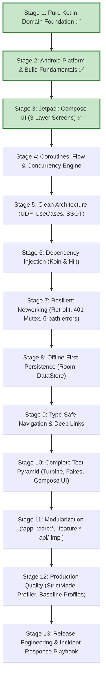

# Enterprise Finance Tracker

> A production-style Android application built incrementally to master the entire Android Development Learning Roadmap.

---

## 🎯 Project Overview & Philosophy

**Enterprise Finance Tracker** is a comprehensive personal finance and wealth management application. It covers:
- **Authentication**: Biometrics, secure session storage, JWT refresh.
- **Accounts & Balances**: Multi-currency bank, credit, and investment accounts.
- **Transactions**: Expense/Income tracking, recurring entries, categorization, receipt attachment.
- **Investments & Portfolio**: Real-time stock/crypto holdings, asset allocation, unrealized P&L, watchlists.
- **Analytics & Budgets**: Spending trends, category limits, predictive cash-flow.
- **Offline-First Resilience**: Local database as Single Source of Truth, background synchronization via WorkManager, conflict resolution.

---

## 🗺️ Architectural Evolution Roadmap (13 Stages)

---

## 📚 Living Project Documentation

- **[ARCHITECTURE.md](ARCHITECTURE.md)** — Architectural blueprint, layer definitions, data flow, and evolution plan.
- **[DECISIONS.md](DECISIONS.md)** — Architecture Decision Records (ADRs) with rationale, alternatives, and tradeoffs.
- **[DEBUGGING.md](DEBUGGING.md)** — Bug investigation logs, root cause analyses, and debugging challenges.
- **[TESTING.md](TESTING.md)** — Testing strategy, test pyramid breakdown, and execution guidelines.

---

## 📍 Current Status

- **Current Stage**: **Stage 3 Completed — Jetpack Compose UI**
- **Artifacts Built**:
  - **3-Layer Screen Pattern**: `LoginRoute`/`LoginScreen`, `DashboardRoute`/`DashboardScreen`, `TransactionListRoute`/`TransactionListScreen`, `TransactionDetailRoute`/`TransactionDetailScreen`.
  - **Material 3 Design System**: Theme, Color palette, Typography, atomic reusable widgets (`TransactionCard`, `HoldingCard`, `CategoryBadge`, `AmountDisplay`, `EmptyStateWidget`).
  - **State Mechanics**: `rememberSaveable` state hoisting, stable `key = { it.id.value }` in `LazyColumn`.
  - **Platform & Build**: AGP Compose plugin, Compose BOM, Android lifecycle activity integration.
