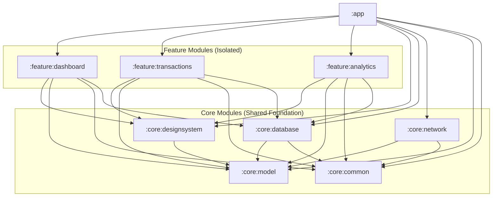

# Enterprise Finance Tracker

> A production-grade Android application built incrementally to master the complete Android Development Learning Roadmap (All 13 Stages Completed).

---

## 🎯 Project Overview & Philosophy

**Enterprise Finance Tracker** is an enterprise-scale personal wealth and portfolio management application built from scratch to embody Google's modern Android engineering standards. It covers:
- **Authentication**: Biometrics, secure token session lifecycle, Mutex-protected JWT refresh.
- **Accounts & Balances**: Multi-currency bank, credit, and investment accounts.
- **Transactions**: Expense/Income tracking, recurring entries, categorization, receipt attachment.
- **Investments & Portfolio**: Real-time stock/crypto holdings, asset allocation, unrealized P&L, watchlists.
- **Analytics & Budgets**: Spending trends, category limits, predictive cash-flow.
- **Offline-First Resilience**: Local SQLite database as Single Source of Truth (SSOT), background synchronization, conflict resolution.
- **Production Architecture**: 9-module Gradle topology, Compose MVI/MVVM, type-safe navigation, comprehensive test pyramid, Baseline Profiles, StrictMode, R8 full-mode shrinking, and production incident response runbooks.

---

## 🚀 Quick Start & Local Setup Guide

For comprehensive prerequisites, environment variable configuration, test execution, and release build steps, see:
👉 **[SETUP_AND_BUILD_GUIDE.md](SETUP_AND_BUILD_GUIDE.md)**

```bash
# 1. Run all tests in parallel
.\gradlew.bat test --parallel

# 2. Build and install Debug APK
.\gradlew.bat installDebug

# 3. Assemble Release APK
.\gradlew.bat assembleRelease
```

---

## 🗺️ Architectural Evolution Roadmap (All 13 Stages Completed)

```mermaid
graph TD
    S01["Stage 1: Pure Kotlin Domain Foundation ✅"] --> S02["Stage 2: Android Platform & Build Fundamentals ✅"]
    S02 --> S03["Stage 3: Jetpack Compose UI (3-Layer Screens) ✅"]
    S03 --> S04["Stage 4: Coroutines, Flow & Concurrency Engine ✅"]
    S04 --> S05["Stage 5: Clean Architecture (UDF, UseCases, SSOT) ✅"]
    S05 --> S06["Stage 6: Dependency Injection (Koin & Hilt) ✅"]
    S06 --> S07["Stage 7: Resilient Networking (Retrofit, 401 Mutex, 6-path errors) ✅"]
    S07 --> S08["Stage 8: Offline-First Persistence (Room, DataStore) ✅"]
    S08 --> S09["Stage 9: Type-Safe Navigation & Deep Links ✅"]
    S09 --> S10["Stage 10: Complete Test Pyramid (Turbine, Fakes, Compose UI) ✅"]
    S10 --> S11["Stage 11: Modularization (:app, :core:*, :feature:*-api/-impl) ✅"]
    S11 --> S12["Stage 12: Production Quality (StrictMode, Profiler, Baseline Profiles) ✅"]
    S12 --> S13["Stage 13: Release Engineering & Incident Response Playbook ✅"]

    style S01 fill:#c8e6c9,stroke:#2e7d32,stroke-width:2px
    style S02 fill:#c8e6c9,stroke:#2e7d32,stroke-width:2px
    style S03 fill:#c8e6c9,stroke:#2e7d32,stroke-width:2px
    style S04 fill:#c8e6c9,stroke:#2e7d32,stroke-width:2px
    style S05 fill:#c8e6c9,stroke:#2e7d32,stroke-width:2px
    style S06 fill:#c8e6c9,stroke:#2e7d32,stroke-width:2px
    style S07 fill:#c8e6c9,stroke:#2e7d32,stroke-width:2px
    style S08 fill:#c8e6c9,stroke:#2e7d32,stroke-width:2px
    style S09 fill:#c8e6c9,stroke:#2e7d32,stroke-width:2px
    style S10 fill:#c8e6c9,stroke:#2e7d32,stroke-width:2px
    style S11 fill:#c8e6c9,stroke:#2e7d32,stroke-width:2px
    style S12 fill:#c8e6c9,stroke:#2e7d32,stroke-width:2px
    style S13 fill:#c8e6c9,stroke:#2e7d32,stroke-width:2px
```



---

## 🏛️ Multi-Module Topology (9 Modules)



---

## 📚 Living Project Documentation

- **[SETUP_AND_BUILD_GUIDE.md](SETUP_AND_BUILD_GUIDE.md)** — Step-by-step local setup, environment configuration, testing, and release build guide.
- **[ARCHITECTURE.md](ARCHITECTURE.md)** — Comprehensive architecture blueprint, module topology, compilation & release pipelines.
- **[DECISIONS.md](DECISIONS.md)** — 38 Architecture Decision Records (ADRs) covering foundational and advanced decisions.
- **[DEBUGGING.md](DEBUGGING.md)** — 27 real-world debugging challenges with progressive hints, solutions, and heap dump triage guides.
- **[TESTING.md](TESTING.md)** — Full test pyramid breakdown (Unit, DAO, ViewModel, Turbine, MockWebServer, UI Logic).
- **[docs/INCIDENT_PLAYBOOK.md](docs/INCIDENT_PLAYBOOK.md)** — P0-P2 incident response runbook, ANR triage, memory leak protocol.
- **[docs/RELEASE_CHECKLIST.md](docs/RELEASE_CHECKLIST.md)** — Production release checklist and staged rollout strategy.
